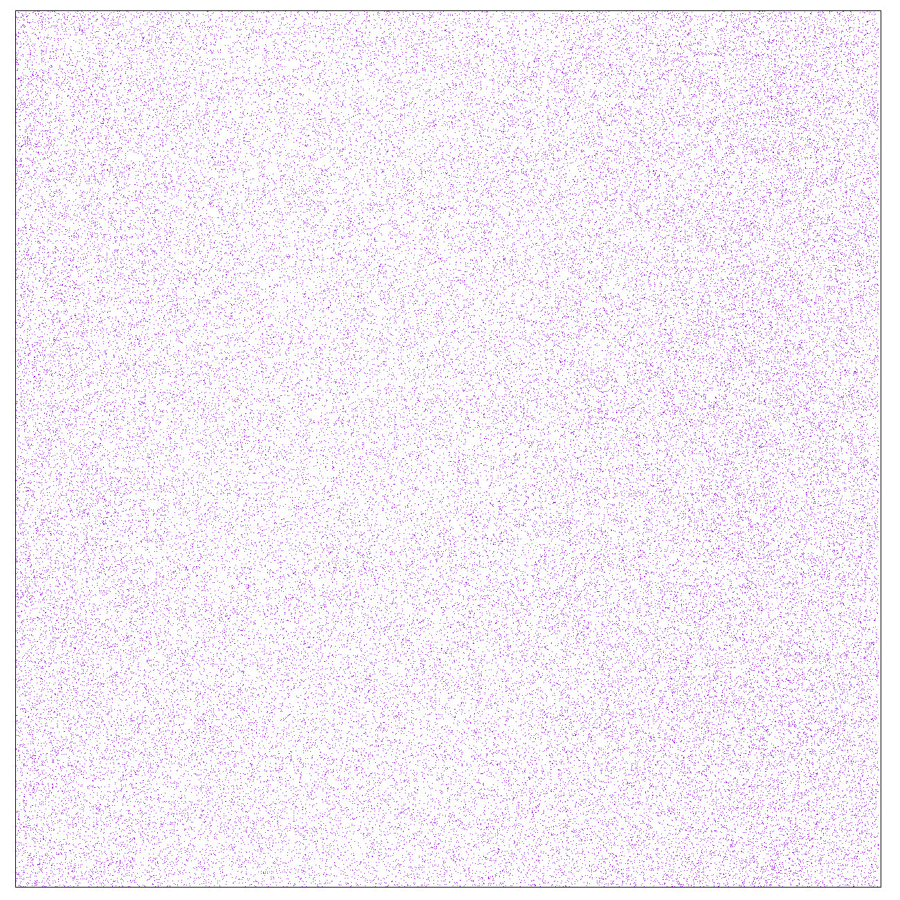
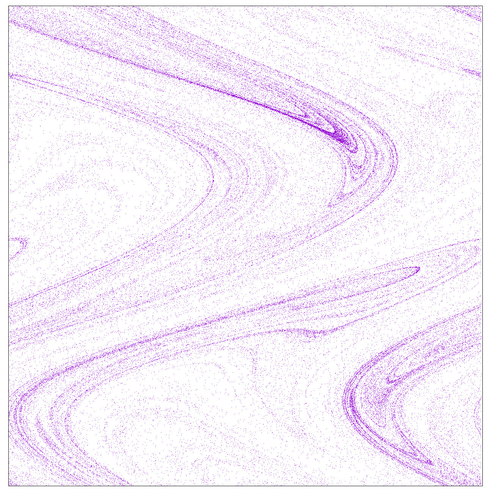

# Program for the Simulation of the phytoplankton in a switching flow

## Purpose

This project implements a numerical simulation of the dynamics of swimming phytoplankton in a periodically switching shear flow.

## Dynamical Model

The simulation follows a population of particles with self-propelled motion and gyrotactic reorientation. The flow alternates between two orthogonal configurations, producing a time-dependent dynamical system.

The motion of a phytoplankton particle is described by:

$$
\frac{d\vec{r}}{dt} = \vec{U}(\vec{r}) + v\vec{p}
$$

and its swimming direction by

$$
\frac{d\vec{p}}{dt} = \frac{1}{2B} \left[ \hat{k}-(\hat{k}\cdot\vec{p})\vec{p} \right] + \frac{1}{2}\vec{\omega} \times \vec{p}
$$

where:

- $v$ is the swimming velocity
- $\vec{p}$ is the unit vector describing the swimming direction
- $B$ is the characteristic time of gyrotactic reorientation
- $\vec{\omega}$ is the vorticity of the flow
- $\hat{k}$ is the vertical unit vector

The flow $\vec{U}$ consists of two stages that alternate periodically.

### Stage 1

$$
U_x(\vec{r}) =  U \cos( ky + \sigma)
$$

$$
U_y(\vec{r}) = 0
$$

### Stage 2

$$
U_x(\vec{r}) = 0
$$

$$
U_y(\vec{r}) = U \cos( kx + \sigma)
$$

The numerical implementation uses dimensionless spatial coordinates and time. The main dimensionless parameters are:

$$
\Psi = UkB
$$

and

$$
F = \frac{v}{U}.
$$


# Program for the Simulation of the phytoplankton in a switching flow

## Purpose

This project implements a numerical simulation of the dynamics of swimming phytoplankton in a periodically switching shear flow.

The simulation follows a population of particles with self-propelled motion and gyrotactic reorientation. The flow alternates between two orthogonal configurations, producing a time-dependent dynamical system.

## Dynamical Model

The motion of a phytoplankton particle is described by:

$$
\frac{d\vec{r}}{dt} = \vec{U}(\vec{r}) + v\vec{p}
$$

and its swimming direction by

$$
\frac{d\vec{p}}{dt} = \frac{1}{2B} \left[ \hat{k}-(\hat{k}\cdot\vec{p})\vec{p} \right] + \frac{1}{2}\vec{\omega} \times \vec{p}
$$

where:

- $v$ is the swimming velocity
- $\vec{p}$ is the unit vector describing the swimming direction
- $B$ is the characteristic time of gyrotactic reorientation
- $\vec{\omega}$ is the vorticity of the flow
- $\hat{k}$ is the vertical unit vector

The flow $\vec{U}$ consists of two stages that alternate periodically.

### Stage 1

$$
U_x(\vec{r}) =  U \cos( ky + \sigma)
$$

$$
U_y(\vec{r}) = 0
$$

### Stage 2

$$
U_x(\vec{r}) = 0
$$

$$
U_y(\vec{r}) = U \cos( kx + \sigma)
$$

The numerical implementation uses dimensionless spatial coordinates and time. The main dimensionless parameters are:

$$
\Psi = UkB
$$

and

$$
F = \frac{v}{U}.
$$


# Program for the Simulation of the phytoplankton in a switching flow

## Purpose

This project implements a numerical simulation of the dynamics of swimming phytoplankton in a periodically switching shear flow.

The simulation follows a population of particles with self-propelled motion and gyrotactic reorientation. The flow alternates between two orthogonal configurations, producing a time-dependent dynamical system.

## Dynamical Model

The motion of a phytoplankton particle is described by:

$$
\frac{d\vec{r}}{dt} = \vec{U}(\vec{r}) + v\vec{p}
$$

and its swimming direction by

$$
\frac{d\vec{p}}{dt} = \frac{1}{2B} \left[ \hat{k}-(\hat{k}\cdot\vec{p})\vec{p} \right] + \frac{1}{2}\vec{\omega} \times \vec{p}
$$

where:

- $v$ is the swimming velocity
- $\vec{p}$ is the unit vector describing the swimming direction
- $B$ is the characteristic time of gyrotactic reorientation
- $\vec{\omega}$ is the vorticity of the flow
- $\hat{k}$ is the vertical unit vector

The flow $\vec{U}$ consists of two stages that alternate periodically.

### Stage 1

$$
U_x(\vec{r}) =  U \cos( ky + \sigma)
$$

$$
U_y(\vec{r}) = 0
$$

### Stage 2

$$
U_x(\vec{r}) = 0
$$

$$
U_y(\vec{r}) = U \cos( kx + \sigma)
$$

The numerical implementation uses dimensionless spatial coordinates and time. The main dimensionless parameters are:

$$
\Psi = UkB
$$

and

$$
F = \frac{v}{U}.
$$


## Numerical Methods

The numerical methods used in the calculation is: **Fourth-order Runge-Kutta method** for numerical integration

The simulation evolves the state of each particle independently at each time step. Periodic boundary conditions are applied to the spatial coordinates.

The two flow configurations are alternated periodically during the simulation, with a new phase parameter $\sigma$ selected when the flow switches configuration.

## Repository Structure

The source code is organized as follows:

```text
Repository Structure
evolution-phytoplankton/
├── README.md
├── src/
│   ├── dynamical_system.cpp
│   ├── dynamical_system.h
│   ├── runge_kutta.cpp
│   ├── runge_kutta.h
│   ├── evolution.cpp
│   └── config.h
├── results/
│   ├── starting_configuration
│   ├── data_file_1
│   ├── data_file_2
│   └── ...
├── plots/
│   ├── dplot_1.jpeg
│   ├── dplot_2.jpeg
│   └── ...
└── gnuscript.gp
```

### Source Files

* `evolution.cpp` initializes the particle population, controls the simulation loop, switches between flow configurations, and saves the simulation output.
* `dynamical_system.cpp/.h` define the dynamical system and its variational equations.
* `runge_kutta.cpp/.h` implement the fourth-order Runge-Kutta integration method.
* `config.h` contains the main configuration parameters used by the program.

### Results

The `results/` directory contains the numerical output generated by the program.


### Plots

The plots/ directory contains visualizations of the particle distribution generated from the numerical results using Gnuplot.

The plots show the evolution of the spatial distribution of the simulated phytoplankton population as the flow switches between its two configurations.

#### Example 1



#### Example 2



### Compilation and Execution

From the project root directory, compile the program with:

g++ -O2 -std=gnu++17 \
    src/evolution.cpp \
    src/runge_kutta.cpp \
    src/dynamical_system.cpp \
    -o evolution

Then run:

./evolution

The simulation writes its numerical output to the results/ directory.

### Generating Plots

After running the simulation, the plots can be generated with:

gnuplot gnuscript.gp

The generated images are saved in the plots/ directory.

## Background

This project was originally developed as part of my Bachelor's thesis in Physics at the University of Turin, titled *"Numerical simulation of the dynamics of phytoplankton in shear flows and calculation of the Lyapunov dimension."*

The code has been reorganized and documented for this repository.

You can find this and othe material in:
https://github.com/marcokorwinkrukowski-creator

> So long, and thanks for all the fish.

## Repository Structure

The source code is organized as follows:

```text
Repository Structure
evolution-phytoplankton/
├── README.md
├── src/
│   ├── dynamical_system.cpp
│   ├── dynamical_system.h
│   ├── runge_kutta.cpp
│   ├── runge_kutta.h
│   ├── evolution.cpp
│   └── config.h
├── results/
│   ├── starting_configuration
│   ├── data_file_1
│   ├── data_file_2
│   └── ...
├── plots/
│   ├── dplot_1.jpeg
│   ├── dplot_2.jpeg
│   └── ...
└── gnuscript.gp
```

### Source Files

* `evolution.cpp` initializes the particle population, controls the simulation loop, switches between flow configurations, and saves the simulation output.
* `dynamical_system.cpp/.h` define the dynamical system and its variational equations.
* `runge_kutta.cpp/.h` implement the fourth-order Runge-Kutta integration method.
* `config.h` contains the main configuration parameters used by the program.

### Results

The `results/` directory contains the numerical output generated by the program.


### Plots

The plots/ directory contains visualizations of the particle distribution generated from the numerical results using Gnuplot.

The plots show the evolution of the spatial distribution of the simulated phytoplankton population as the flow switches between its two configurations.

#### Example 1


#### Example 2


### Compilation and Execution

From the project root directory, compile the program with:

g++ -O2 -std=gnu++17 \
    src/evolution.cpp \
    src/runge_kutta.cpp \
    src/dynamical_system.cpp \
    -o evolution

Then run:

./evolution

The simulation writes its numerical output to the results/ directory.

### Generating Plots

After running the simulation, the plots can be generated with:

gnuplot gnuscript.gp

The generated images are saved in the plots/ directory.

## Background

This project was originally developed as part of my Bachelor's thesis in Physics at the University of Turin, titled *"Numerical simulation of the dynamics of phytoplankton in shear flows and calculation of the Lyapunov dimension."*

The code has been reorganized and documented for this repository.

You can find this and othe material in:
https://github.com/marcokorwinkrukowski-creator

> So long, and thanks for all the fish.

## Repository Structure

The source code is organized as follows:

```text
Repository Structure
evolution-phytoplankton/
├── README.md
├── src/
│   ├── dynamical_system.cpp
│   ├── dynamical_system.h
│   ├── runge_kutta.cpp
│   ├── runge_kutta.h
│   ├── evolution.cpp
│   └── config.h
├── results/
│   ├── starting_configuration
│   ├── data_file_1
│   ├── data_file_2
│   └── ...
├── plots/
│   ├── dplot_1.jpeg
│   ├── dplot_2.jpeg
│   └── ...
└── gnuscript.gp
```

### Source Files

* `evolution.cpp` initializes the particle population, controls the simulation loop, switches between flow configurations, and saves the simulation output.
* `dynamical_system.cpp/.h` define the dynamical system.
* `runge_kutta.cpp/.h` implement the fourth-order Runge-Kutta integration method.
* `config.h` contains the main configuration parameters used by the program.

### Results

The `results/` directory contains the numerical output generated by the program.


### Plots

The plots/ directory contains visualizations of the particle distribution generated from the numerical results using Gnuplot.

The plots show the evolution of the spatial distribution of the simulated phytoplankton population as the flow switches between its two configurations.

#### Example 1


#### Example 2


### Compilation and Execution

From the project root directory, compile the program with:

g++ -O2 -std=gnu++17 \
    src/evolution.cpp \
    src/runge_kutta.cpp \
    src/dynamical_system.cpp \
    -o evolution

Then run:

./evolution

The simulation writes its numerical output to the results/ directory.

### Generating Plots

After running the simulation, the plots can be generated with:

gnuplot gnuscript.gp

The generated images are saved in the plots/ directory.

## Background

This project was originally developed as part of my Bachelor's thesis in Physics at the University of Turin, titled *"Numerical simulation of the dynamics of phytoplankton in shear flows and calculation of the Lyapunov dimension."*

The code has been reorganized and documented for this repository.

The complete project is available on GitHub:

[GitHub repository](https://github.com/marcokorwinkrukowski-creator/evolution-phytoplankton)

> So long, and thanks for all the fish.
