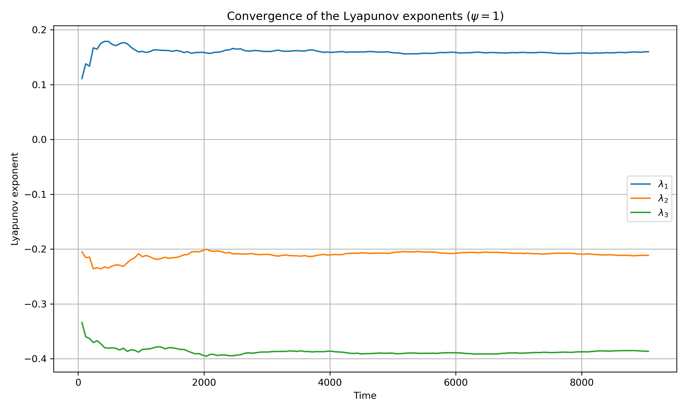
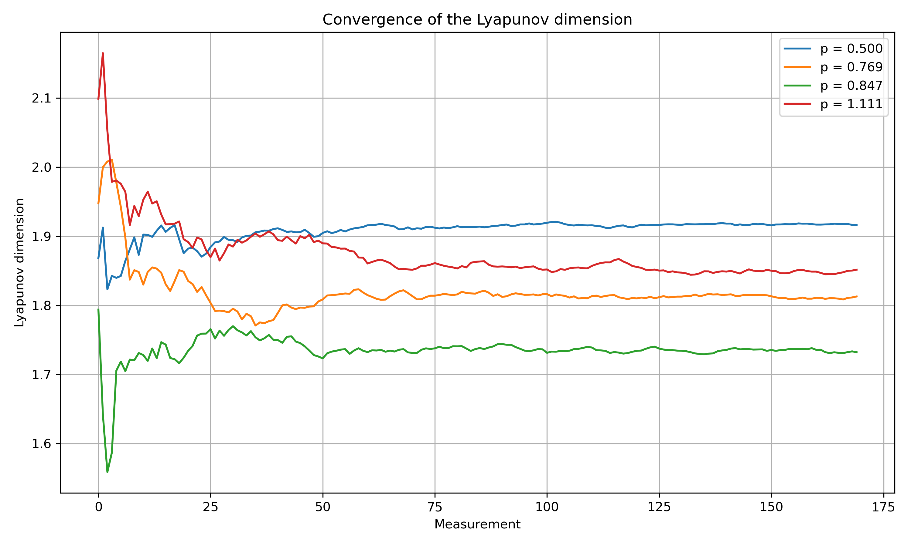

# Program for the Calculation of Lyapunov Exponents and Dimension

## Important Usage Note

The program runs indefinitely and must be stopped manually.

At regular intervals, the current data are saved in the results/ directory. Plotting these data allows the convergence of the calculated quantities to be monitored over time.

The simulation can be stopped once the desired convergence has been reached.

## Purpose

The program calculates the Lyapunov exponents of a system representing the two-dimensional motion of phytoplankton in an alternating sinusoidal flow.

The exponents are then used to calculate the Lyapunov dimension.

The calculation is performed for different values of the system parameter $\psi$.

## Dynamical Model

The dynamical model describes the evolution of:

$$
\frac{d\vec{r}}{dt} = \vec{U}(\vec{r}) + v\vec{p}
$$

$$
\frac{d\vec{p}}{dt} = \frac{1}{2B} \left[ \hat{k}-(\hat{k}\cdot\vec{p})\vec{p} \right] + \frac{1}{2}\vec{\omega} \times \vec{p}
$$

where:

- $v$ is the swimming velocity
- $\vec{p}$ is the unit vector describing the swimming direction
- $B$ is the characteristic time of gyrotactic reorientation
- $\vec{\omega}$ is the vorticity of the flow
- $\hat{k}$ is the vertical unit vector

The flow $\vec{U}$ consists of two stages that alternate periodically.

### Stage 1

$$
U_x(\vec{r}) =  U \cos( ky + \sigma)
$$

$$
U_y(\vec{r}) = 0
$$

### Stage 2

$$
U_x(\vec{r}) = 0
$$

$$
U_y(\vec{r}) = U \cos( kx + \sigma)
$$

The corresponding dimensionless evolution equations are:

### Stage 1

$$
\frac{dx}{dt} = \cos(y + \sigma) + F\cos(\alpha)
$$

$$
\frac{dy}{dt} = F \sin (\alpha)
$$

$$
\frac{d\alpha}{dt} = \frac{1}{2\psi}\cos(\alpha)-\frac{1}{2}\sin(y + \sigma)
$$

### Stage 2 

$$
\frac{dx}{dt} = F\cos(\alpha)
$$

$$
\frac{dy}{dt} = \cos(x + \sigma) + F \sin (\alpha)
$$

$$
\frac{d\alpha}{dt} = \frac{1}{2\psi}\cos(\alpha)-\frac{1}{2}\sin(x + \sigma)
$$

## Lyapunov Exponents

In the study of dynamical systems, Lyapunov exponents characterize the sensitivity of a system to initial conditions.

The algorithm used to calculate the Lyapunov exponents is based on the method introduced by Benettin et al. [Meccanica 15, 9–20 (1980)].

The method consists of evolving the particle trajectory together with three tangent vectors. The logarithmic growth of the tangent vectors is calculated and accumulated over time. Dividing the accumulated growth by time gives estimates of the Lyapunov exponents, which converge as the number of integration cycles increases.

At each iteration of the cycle, the tangent vectors are orthogonalized using the Gram-Schmidt procedure and then normalized.

## Lyapunov Dimension

The Lyapunov dimension can be used as an estimate of the fractal dimension of an attractor.
It is calculated from the Lyapunov exponents using the Kaplan-Yorke formula.

$$
D_{KY} = j + \frac{\displaystyle\sum_{i=1}^{j}\lambda_i}{|\lambda_{j+1}|}
$$

where $j$ is the largest integer such that:

$$
\sum_{i=1}^{j}\lambda_i \geq 0
$$

and

$$
\sum_{i=1}^{j+1}\lambda_i < 0
$$

where $\lambda_i$ are the Lyapunov exponents, ordered from largest to smallest.

## Numerical Methods

The numerical methods used in the calculation are:

* **Benettin algorithm** for the computation of the Lyapunov exponents
* **Gram-Schmidt orthogonalization** for the orthogonalization of the tangent vectors
* **Fourth-order Runge-Kutta method** for numerical integration

## Repository Structure

The source code is organized as follows:

```text
lyapunov-phytoplankton/
├── README.md
├── src/
│   ├── lyapunov.cpp
│   ├── dynamical_system.cpp
│   ├── dynamical_system.h
│   ├── runge_kutta.cpp
│   ├── runge_kutta.h
│   ├── gram_schmidt.cpp
│   ├── gram_schmidt.h
│   ├── tangent_norm.cpp
│   ├── tangent_norm.h
│   ├── tangent_normalization.cpp
│   ├── tangent_normalization.h
│   └── config.h
├── results/
│   ├── lyapunov_exponents_group1.dat
│   ├── lyapunov_exponents_group2.dat
│   ├── lyapunov_exponents_group3.dat
│   ├── lyapunov_exponents_group4.dat
│   └── lyapunov_dimension.dat
├── plot_dimensioni.py
└── plot_lyapunov.py
```

### Source Files

* `lyapunov.cpp` contains the main program and the calculation of the Lyapunov exponents and dimension.
* `dynamical_system.cpp/.h` define the dynamical system and its variational equations.
* `runge_kutta.cpp/.h` implement the fourth-order Runge-Kutta integration method.
* `gram_schmidt.cpp/.h` implement the Gram-Schmidt orthogonalization of the tangent vectors.
* `tangent_norm.cpp/.h` calculate the norms of the tangent vectors.
* `tangent_normalization.cpp/.h` normalize the tangent vectors.
* `config.h` contains the main configuration parameters used by the program.

### Results

The `results/` directory contains the numerical output generated by the program.
The Lyapunov exponent results are divided into four files for easier data management and analysis, each containing a group of parameter values.

* `lyapunov_exponents_group1.dat` contains the Lyapunov exponents for the first group of parameter values.
* `lyapunov_exponents_group2.dat` contains the Lyapunov exponents for the second group of parameter values.
* `lyapunov_exponents_group3.dat` contains the Lyapunov exponents for the third group of parameter values.
* `lyapunov_exponents_group4.dat` contains the Lyapunov exponents for the fourth group of parameter values.
* `lyapunov_dimension.dat` contains the corresponding Lyapunov dimension for all parameter values.

The following figures show the convergence of the numerical estimates
obtained during the simulation.

### Lyapunov Exponents

The figure below shows the convergence of the three Lyapunov exponents
for $\psi = 1$.



### Lyapunov Dimension

The figure below shows the convergence of the Lyapunov dimension
for selected values of $\psi$.



## Background

This project was originally developed as part of my Bachelor's thesis in Physics at the University of Turin, titled *"Numerical simulation of the dynamics of phytoplankton in shear flows and calculation of the Lyapunov dimension."*

The code has been reorganized and documented for this repository.

> So long, and thanks for all the fish.
